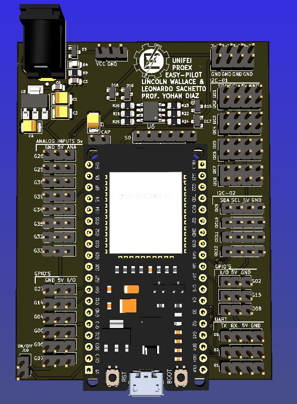
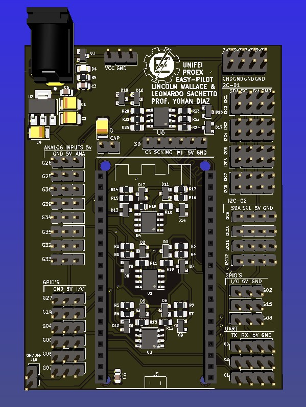
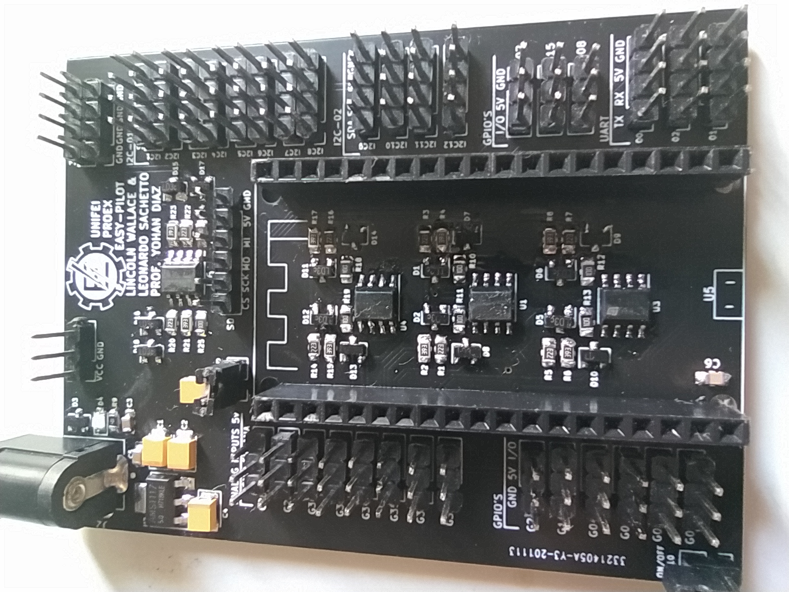

# Shield-for-ESP32-38-pins-version-
> That's work is about a shield created for the ESP32 DEVKIT V1 (38 pins version) for using with a data acquisition system for a unmanned aerial vehicle (UAV's) 

In this Shield some buffers with voltage dividers are used to adapt the use of 5V analog sensors in 3.3V ESP32 analog inputs.

